# RunnelMoE

RunnelMoE is an independent project building a model-agnostic inference runtime
for sparse Mixture-of-Experts models whose expert weights are larger than
available RAM. It is designed to make the hard tradeoffs visible: verified
storage, bounded memory, asynchronous I/O, cache policy, numerical parity,
request scheduling, and honest measurement.

> Project status: M0 design/provenance, the M1 tiny-reference runtime, the M2
> verified out-of-core data plane, M3 cache-policy research, and the M4
> compact-BF16/AVX2 kernel have passed their milestone gates. M3 closes a
> synthetic modeled-traffic gate, not a runtime speedup gate. M4 verifies one
> narrow kernel and tiny adapter, with timing limited to fixed synthetic GEMV
> batches on one recorded host; neither milestone is an end-to-end inference
> speedup claim.

The runtime's central contract is simple: a configured
resident-memory ceiling
must remain enforceable while expert tensors move between an immutable
content-addressed object store, a bounded DRAM cache, and compute. Corrupt or
ambiguous artifacts fail closed. Optimized paths remain differential-testable
against an intentionally plain scalar implementation and an independent
Python/PyTorch oracle.

## Why this project exists

Sparse models turn parameter capacity into a data-movement problem. A token
uses only a few experts, but routing, cache admission, prefetch, batching, and
storage latency interact. RunnelMoE is intended to become an experiment
platform and local runtime for studying those interactions under explicit
resource budgets. It is not a claim that commodity CPUs make frontier-scale
models practical.

## Current executable slice

M1 supplies a strict, eager-memory-budgeted RMOA artifact reader; a
formula-generated 7,904-byte synthetic tensor object; scalar Rust tokenization,
two-head causal attention, stable top-2 MoE routing, and greedy generation; an
independently organized vectorized PyTorch oracle; and a black-box CLI. The
fixture contains no trained data or committed weight file.

M2 adds a descriptor-retaining content-addressed store, resumable verified
staging with manifest-last publication, a bounded positional reader, a fixed
asynchronous reader pool, a 64-byte-quantized byte-capacity LRU cache, explicit
leases, fault tests, bounded traces, cache counters, and separate RSS samples.
The tiny adapter integration reconstructs verified tensors before scalar
execution; it does not yet stream expert pages during each token's compute.

The M3 research harness adds strict policy-neutral JSONL traces, byte LRU,
SLRU, TinyLFU admission, causal router-aware admission/prefetch, uniform-page
Bélády/MIN, and a bounded exact variable-byte oracle. It measures modeled
physical traffic and cache pollution; it does not predict storage latency or
runtime throughput. In the accepted exploratory matrix, the four candidates'
72 unadjusted interval positions versus LRU split 29 below one, 21 overlapping
one, and 22 above one. The workload-sensitive
[raw summary](benchmarks/raw/m3-cache-policies-20260803/summary.json) and
[M3 review](docs/reviews/M3_REVIEW.md) support no general winner. The production
M2 cache remains independently testable and is not silently replaced by a
research policy.

M4 adds a 5,600-byte adapter-v2 synthetic object whose twelve routed-expert
matrices remain compact BF16, an independently callable safe-Rust scalar
reference, and one runtime-dispatched C AVX2 GEMV behind a small validated ABI.
Scalar and forced-AVX2 tiny-model paths preserve selected expert IDs and tokens
exactly and pass the declared router-score, route-weight, and logit tolerances
against independently generated PyTorch vectors. On the recorded AMD EPYC
7R13 VM, the two preregistered one-thread streaming cells had AVX2/scalar
paired median batch-time ratios of
0.1767 and 0.1832, with both unadjusted 95% bootstrap intervals below one.
These fixed synthetic results satisfy the preregistered M4 rule; they do not
measure token throughput, serving latency, storage I/O, or other hardware.
See the [raw summary](benchmarks/raw/m4-bf16-gemv-20260803/summary.json) and
[M4 review](docs/reviews/M4_REVIEW.md).

## Setup and executable proof

Requirements are Git and the pinned Rust toolchain. Python is needed only for
the independent oracle and evidence checks. From a fresh checkout:

```console
git clone https://github.com/omar07ibrahim/runnelmoe.git
cd runnelmoe
cargo build --locked \
  -p runnel --bin runnel --bin runnel-m4-model-check \
  -p runnel-sim --bin runnel-cache-sim
cargo run --locked -p runnel -- \
  demo --prompt moe --max-new-tokens 4 --json
```

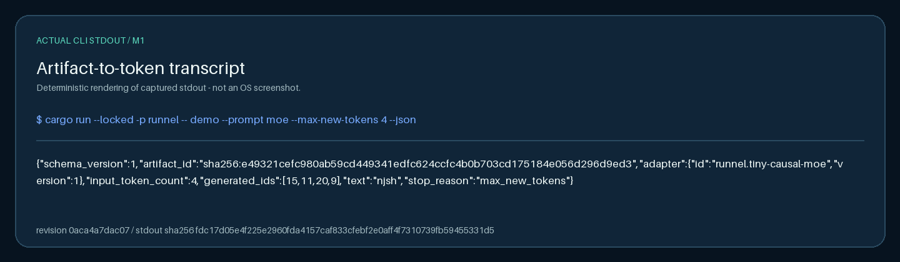

*This is a deterministic rendering of the [captured M1
stdout](docs/visual-evidence/m1-m4-0aca4a7/raw/m1-demo.stdout), not an
operating-system screenshot. The fixture output is systems-test evidence, not
language-quality or performance evidence.*

## M1-M4 workflow

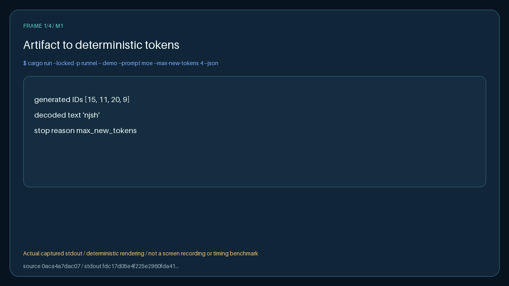

*The animation presents the four actual stdout streams in order. It is not a
screen recording, benchmark timeline, or latency visualization. See the
[closed manifest](docs/visual-evidence/m1-m4-0aca4a7/manifest.json) and
[SHA-256 inventory](docs/visual-evidence/m1-m4-0aca4a7/SHA256SUMS).*

## Source-backed M1-M4 results

Every card below was derived from captured output at source revision
`0aca4a7dac07b437afa56f4e3a527232bfaf6123`. The linked raw streams are
authoritative; the cards are navigational summaries.

### M1: artifact to deterministic tokens

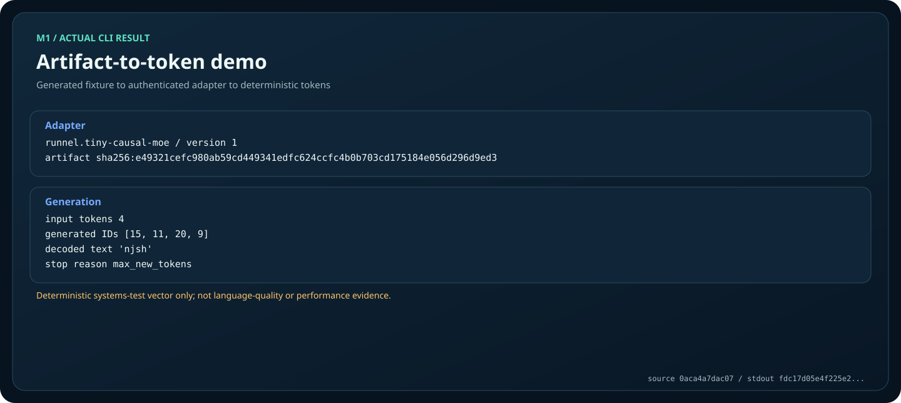

The generated fixture authenticates as the tiny causal-MoE adapter and produces
IDs `[15, 11, 20, 9]`, decoded as `"njsh"`. This is a deterministic
systems vector, not model-quality evidence. [Raw
stdout](docs/visual-evidence/m1-m4-0aca4a7/raw/m1-demo.stdout) /
[reproduce](#reproduce-and-check)

### M2: verified bounded data plane

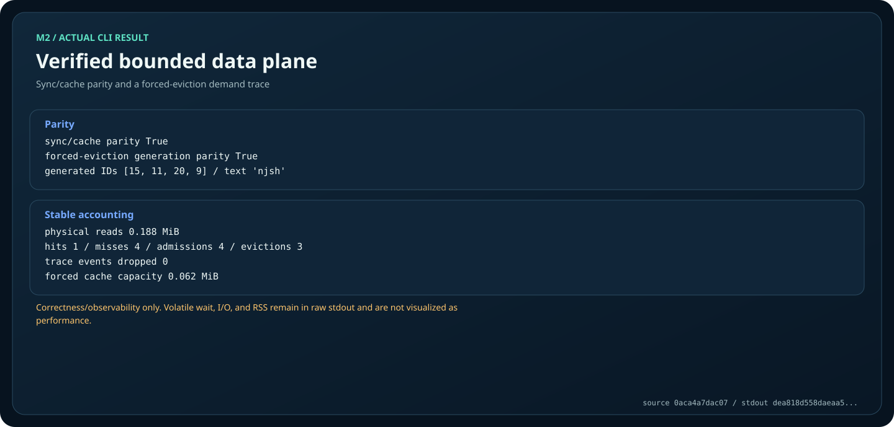

The captured demand trace preserves sync/cache and forced-eviction generation
parity, with one hit, four misses, four admissions, three evictions, and no
dropped trace events. Volatile wait, I/O, and RSS fields remain only in [raw
stdout](docs/visual-evidence/m1-m4-0aca4a7/raw/m2-data-plane.stdout); they are
not performance claims. [Reproduce](#reproduce-and-check)

### M3: one-seed functional smoke

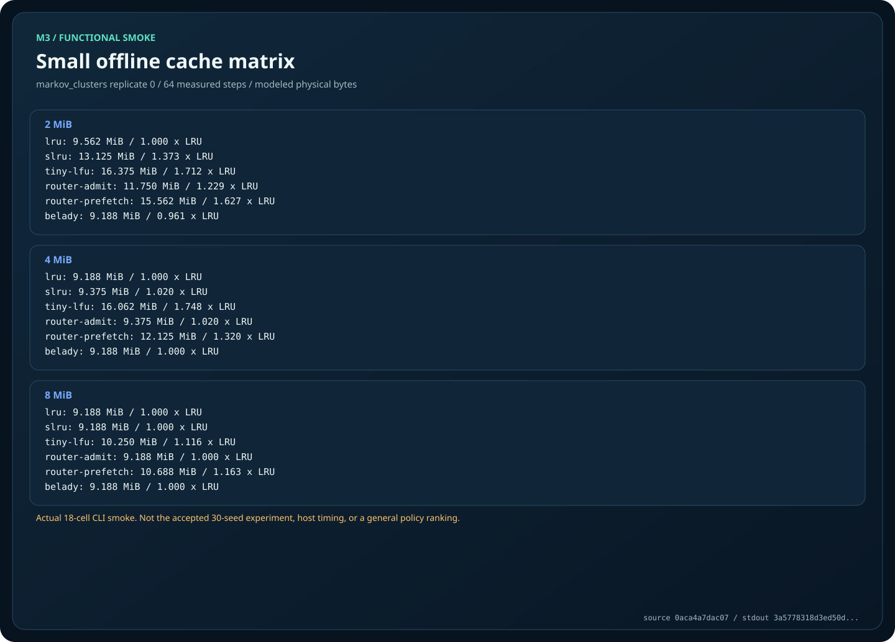

This is one deterministic replicate/seed with 64 measured steps and 18 cells.
It checks policy plumbing and modeled byte accounting. It is not a benchmark,
not the accepted 30-seed experiment, and not evidence for a general policy
winner. [Raw
stdout](docs/visual-evidence/m1-m4-0aca4a7/raw/m3-cache-matrix.stdout) /
[reproduce](#reproduce-and-check)

### M4: complete-model correctness ledger

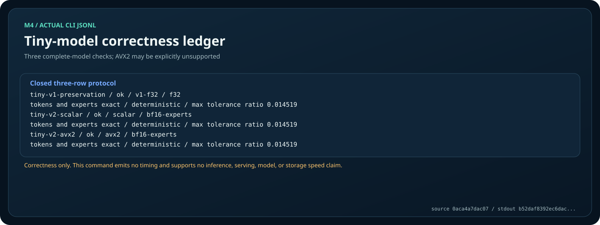

All three rows completed on the capture host with exact selected experts and
tokens; the maximum declared tolerance ratio was `0.014519`. This command
emits no timing, and AVX2 is explicitly `unsupported` on a host without that
ISA. [Raw
stdout](docs/visual-evidence/m1-m4-0aca4a7/raw/m4-model-check.stdout) /
[reproduce](#reproduce-and-check)

## Implemented architecture and limits

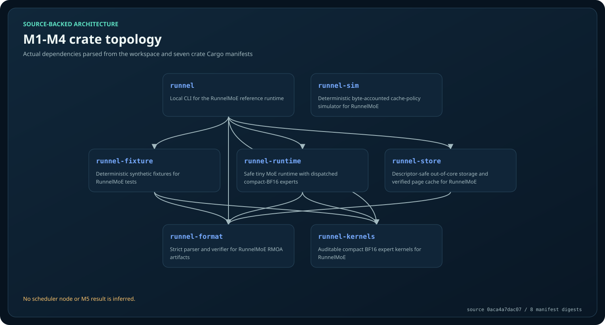

*The graph is parsed from the workspace and seven crate manifests at the
captured source revision. It deliberately excludes the unaccepted scheduler;
it is not a picture of planned M5 behavior.*

The current boundary is intentionally narrow:

- M1 uses generated fixtures and proves deterministic execution, not language
  quality.
- M2 reconstructs authenticated tensors before scalar execution; it does not
  stream expert pages during each token's compute.
- M3's card is a one-seed functional smoke with modeled bytes, not host timing.
- M4's correctness card has no timing; the separate accepted M4 figures below
  cover only fixed synthetic GEMV batches on one recorded host.
- No M5 scheduler result, multi-request serving result, production endpoint, or
  end-to-end inference-speed claim is represented.

## Accepted M3–M4 visual evidence

These five committed SVGs are regenerated byte-for-byte from the accepted raw
M3 and M4 evidence by their archival verifiers. The linked JSON summaries
remain authoritative. The intervals are unadjusted per-cell descriptions, and
the figures do not establish an end-to-end inference or serving speedup.

### M3: synthetic modeled cache traffic

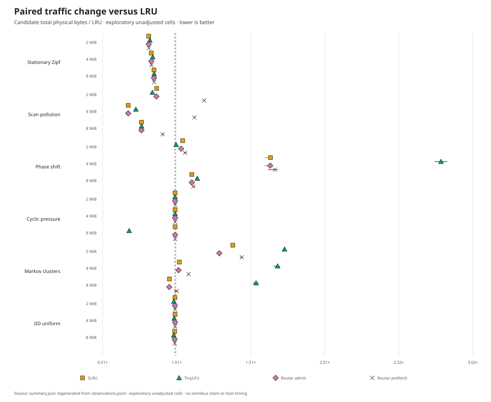

*Candidate total physical bytes divided by LRU, using the median of 30 paired
replicates and an unadjusted 95% percentile-bootstrap interval for each cell;
lower is better. Results change with workload and capacity, so the accepted
matrix supports no general policy winner and makes no host-timing claim.*

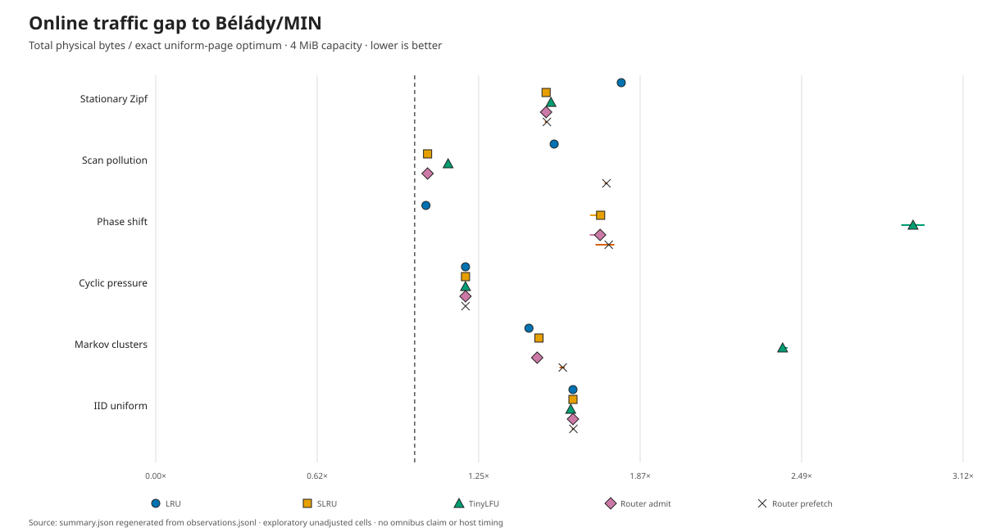

*Median total physical-byte ratios to the exact uniform-page Bélády/MIN oracle
at 4 MiB. This is a synthetic modeled-traffic comparison, not a storage-latency
or production-optimality result.*

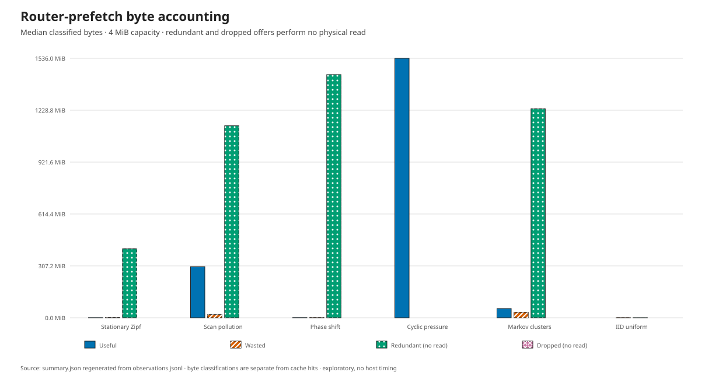

*Median useful, wasted, redundant, and dropped router-prefetch bytes at 4 MiB.
Redundant and dropped offers perform no modeled physical read; the chart
explains accounting rather than runtime performance.*

### M4: fixed synthetic BF16 GEMV batches

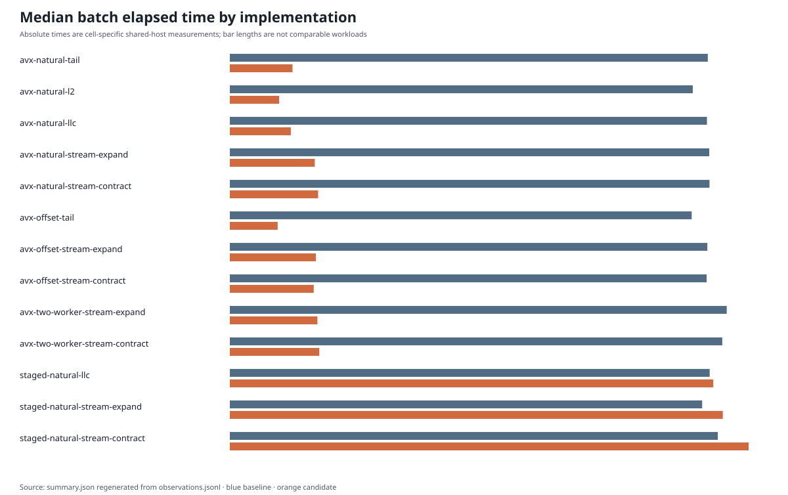

*Median baseline and candidate elapsed time for every complete preregistered
cell on the recorded AMD EPYC 7R13 host. These are fixed synthetic GEMV batches,
not token throughput, serving latency, or storage-I/O measurements.*

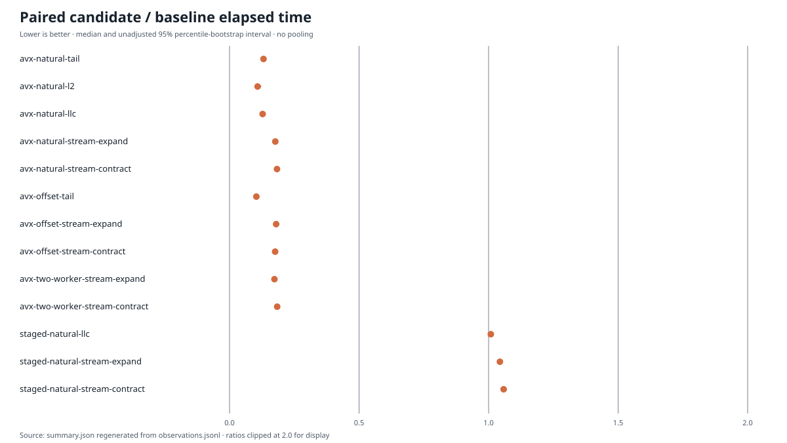

*Per-pair candidate/scalar median elapsed-time ratios with unadjusted 95%
percentile-bootstrap intervals. The preregistered rule is satisfied only for
the two named primary cells on the recorded host; the figure supports no
general CPU, compiler, model, or inference-speed ranking.*

## Reproduce and check

Verify the adopted payload against its raw streams, provenance metadata, and
asset bounds with Python 3.12.11 and the locked Pillow wheel:

```console
python3 -m pip install --disable-pip-version-check --no-deps \
  --only-binary=:all: --require-hashes -r scripts/visual-requirements.txt
python3 scripts/generate_visual_evidence.py verify \
  --input docs/visual-evidence/m1-m4-0aca4a7 \
  --expected-revision 0aca4a7dac07b437afa56f4e3a527232bfaf6123
python3 scripts/verify_repository.py
```

The [capture and rendering
contract](docs/VISUAL_EVIDENCE.md#source-captures) records the exact command
vectors and nonclaims. To rerun each executable surface:

Run the complete artifact-to-token demo after fetching the locked Rust
dependencies once:

```console
cargo run --locked -p runnel -- demo --prompt moe --max-new-tokens 4 --json
```

The stable fixture result is generated IDs `[15, 11, 20, 9]`, decoded as
`"njsh"`. This is a systems-test vector, not language-model-quality evidence.
See [development](docs/DEVELOPMENT.md) for the complete verification suite.

Exercise sync/cached numerical parity and a forced-eviction three-page trace:

```console
cargo run --locked -p runnel -- data-plane-demo --json
```

This command reports exact byte and cache-transition accounting alongside
volatile I/O-wait and RSS observations. It is a correctness/observability demo,
not a throughput comparison. The committed [M2 review](docs/reviews/M2_REVIEW.md)
and [schema-v2 raw evidence](benchmarks/raw/m2-data-plane-forced-eviction-20260803/summary.json)
record the closed gate and its limitations.

Run a small offline M3 policy matrix:

```console
cargo run --locked -p runnel-sim --bin runnel-cache-sim -- \
  matrix --family markov_clusters --replicate 0 --measured-steps 64
```

The JSON contains all six frozen policies at three capacities. This command is
a deterministic functional smoke test, not the 30-seed accepted experiment or
a timing benchmark. Cache-policy semantics are frozen in
[ADR-0005](docs/adr/0005-cache-policy-research.md).

Emit the M4 tiny-model correctness ledger:

```console
cargo run --locked -p runnel --bin runnel-m4-model-check
```

This produces three JSONL correctness records for tiny-v1 preservation and
tiny-v2 scalar/AVX2 execution. It is not a timing benchmark. The accepted
AVX2 record is typed `unsupported` on a host without that ISA. The accepted
performance procedure is frozen in
[ADR-0006](docs/adr/0006-bf16-avx2-expert-kernel.md).

## Architecture contract

- Rust owns parsing, verified storage/cache, the scalar reference runtime, and
  dispatch; later milestones add multi-request scheduling and serving.
- A narrow C ABI contains the measured AVX2 GEMV; scalar Rust remains the
  independently callable correctness baseline.
- Python/PyTorch is used only as an independently structured oracle, golden
  vector generator, and analysis environment.
- CI and demos will use tiny generated data. No proprietary or multi-gigabyte
  checkpoint will be required.
- Network listeners, when added, will bind to loopback by default.

See [design](docs/DESIGN.md), [artifact format](docs/FORMAT.md),
[threat model](docs/THREAT_MODEL.md),
[benchmark contract](docs/BENCHMARKING.md), [claim ledger](docs/CLAIMS.md),
and [prior-art record](docs/PRIOR_ART.md).

## Run the repository contract check

Requirements: Python 3.12+ and Git. The M0 check uses only the Python standard
library.

    python3 scripts/verify_repository.py

Executable milestone commands are recorded in
[development](docs/DEVELOPMENT.md). Raw benchmark outputs, including
environment metadata, live under
`benchmarks/raw/`; generated summaries will never be the sole evidence for a
claim.

## Independence

RunnelMoE is not a fork, port, rename, or Kimi implementation. Kimi K3 is one
source of model-system requirements and may receive an optional adapter only
after the model-agnostic runtime is established. No code, prose, fixtures,
artwork, or benchmark numbers from the referenced C project are used here. Its
distinctive directory layout was not used as a template; shared governance and
documentation filenames are conventional or mission-required. The boundary and studied sources are recorded in
[ADR-0001](docs/adr/0001-clean-room-and-system-boundaries.md).

## License

Apache License 2.0. See [LICENSE](LICENSE) and [NOTICE](NOTICE).
